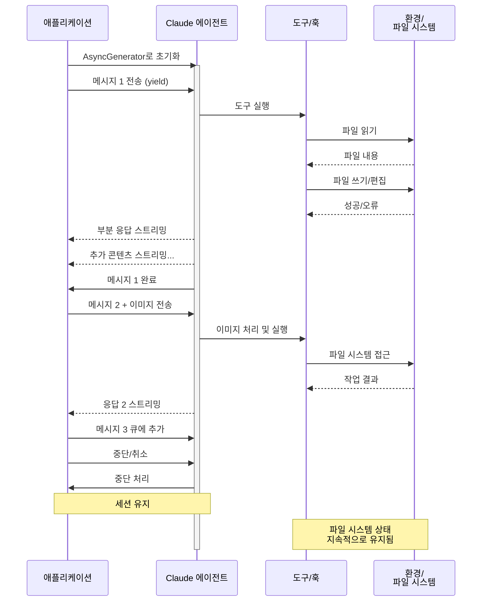

# 스트리밍 입력

> Claude Agent SDK의 두 가지 입력 모드와 각 모드의 적합한 사용 사례 이해하기

## 개요

Claude Agent SDK는 에이전트와 상호작용하는 두 가지 입력 모드를 지원합니다.

* **스트리밍 입력 모드** (기본값 및 권장) - 지속적이고 대화형 세션
* **단일 메시지 입력** - 세션 상태 및 재개 기능을 활용하는 일회성 쿼리

이 가이드는 두 모드의 차이점, 장점, 사용 사례를 설명하여 애플리케이션에 적합한 방식을 선택할 수 있도록 도와줍니다.

## 스트리밍 입력 모드 (권장)

스트리밍 입력 모드는 Claude Agent SDK를 사용하는 **권장** 방식입니다. 에이전트의 모든 기능에 대한 완전한 접근을 제공하며 풍부한 대화형 경험을 가능하게 합니다.

에이전트가 오랫동안 실행되는 프로세스로 동작하여 사용자 입력을 받고, 중단을 처리하고, 권한 요청을 표시하며, 세션 관리를 수행할 수 있습니다.

### 동작 방식



### 장점

**이미지 업로드**

시각적 분석 및 이해를 위해 메시지에 이미지를 직접 첨부할 수 있습니다.

**큐에 쌓인 메시지**

순차적으로 처리되는 여러 메시지를 전송하고, 중단할 수 있는 기능을 제공합니다.

**도구 통합**

세션 중 모든 도구 및 커스텀 MCP 서버에 대한 완전한 접근이 가능합니다.

**훅 지원**

라이프사이클 훅을 사용하여 다양한 시점에서 동작을 커스터마이징할 수 있습니다.

**실시간 피드백**

최종 결과만이 아니라 생성되는 과정에서 응답을 실시간으로 확인할 수 있습니다.

**컨텍스트 지속성**

여러 대화 턴에 걸쳐 자연스럽게 대화 컨텍스트를 유지합니다.

### 구현 예시

::: code-group

```typescript [TypeScript]
import { query } from "@anthropic-ai/claude-agent-sdk";
import { readFile } from "fs/promises";

async function* generateMessages() {
  // 첫 번째 메시지
  yield {
    type: "user" as const,
    message: {
      role: "user" as const,
      content: "Analyze this codebase for security issues"
    }
  };

  // 조건 또는 사용자 입력 대기
  await new Promise((resolve) => setTimeout(resolve, 2000));

  // 이미지가 포함된 후속 메시지
  yield {
    type: "user" as const,
    message: {
      role: "user" as const,
      content: [
        {
          type: "text",
          text: "Review this architecture diagram"
        },
        {
          type: "image",
          source: {
            type: "base64",
            media_type: "image/png",
            data: await readFile("diagram.png", "base64")
          }
        }
      ]
    }
  };
}

// 스트리밍 응답 처리
for await (const message of query({
  prompt: generateMessages(),
  options: {
    maxTurns: 10,
    allowedTools: ["Read", "Grep"]
  }
})) {
  if (message.type === "result") {
    console.log(message.result);
  }
}
```

```python [Python]
from claude_agent_sdk import (
    ClaudeSDKClient,
    ClaudeAgentOptions,
    AssistantMessage,
    TextBlock,
)
import asyncio
import base64


async def streaming_analysis():
    async def message_generator():
        # 첫 번째 메시지
        yield {
            "type": "user",
            "message": {
                "role": "user",
                "content": "Analyze this codebase for security issues",
            },
        }

        # 조건 대기
        await asyncio.sleep(2)

        # 이미지가 포함된 후속 메시지
        with open("diagram.png", "rb") as f:
            image_data = base64.b64encode(f.read()).decode()

        yield {
            "type": "user",
            "message": {
                "role": "user",
                "content": [
                    {"type": "text", "text": "Review this architecture diagram"},
                    {
                        "type": "image",
                        "source": {
                            "type": "base64",
                            "media_type": "image/png",
                            "data": image_data,
                        },
                    },
                ],
            },
        }

    # 스트리밍 입력을 위해 ClaudeSDKClient 사용
    options = ClaudeAgentOptions(max_turns=10, allowed_tools=["Read", "Grep"])

    async with ClaudeSDKClient(options) as client:
        # 스트리밍 입력 전송
        await client.query(message_generator())

        # 응답 처리
        async for message in client.receive_response():
            if isinstance(message, AssistantMessage):
                for block in message.content:
                    if isinstance(block, TextBlock):
                        print(block.text)


asyncio.run(streaming_analysis())
```

:::

## 단일 메시지 입력

단일 메시지 입력은 더 간단하지만 기능이 제한적입니다.

### 단일 메시지 입력을 사용할 경우

다음과 같은 경우에 단일 메시지 입력을 사용하세요.

* 일회성 응답이 필요한 경우
* 이미지 첨부, 훅 등이 필요하지 않은 경우
* 람다 함수와 같은 무상태(stateless) 환경에서 실행해야 하는 경우

### 제한 사항

::: warning
단일 메시지 입력 모드는 다음 기능을 **지원하지 않습니다**.

* 메시지에 직접 이미지 첨부
* 동적 메시지 큐잉
* 실시간 중단
* 훅 통합
* 자연스러운 멀티턴 대화
:::

### 구현 예시

::: code-group

```typescript [TypeScript]
import { query } from "@anthropic-ai/claude-agent-sdk";

// 간단한 일회성 쿼리
for await (const message of query({
  prompt: "Explain the authentication flow",
  options: {
    maxTurns: 1,
    allowedTools: ["Read", "Grep"]
  }
})) {
  if (message.type === "result") {
    console.log(message.result);
  }
}

// 세션 관리를 통한 대화 이어가기
for await (const message of query({
  prompt: "Now explain the authorization process",
  options: {
    continue: true,
    maxTurns: 1
  }
})) {
  if (message.type === "result") {
    console.log(message.result);
  }
}
```

```python [Python]
from claude_agent_sdk import query, ClaudeAgentOptions, ResultMessage
import asyncio


async def single_message_example():
    # query() 함수를 사용한 간단한 일회성 쿼리
    async for message in query(
        prompt="Explain the authentication flow",
        options=ClaudeAgentOptions(max_turns=1, allowed_tools=["Read", "Grep"]),
    ):
        if isinstance(message, ResultMessage):
            print(message.result)

    # 세션 관리를 통한 대화 이어가기
    async for message in query(
        prompt="Now explain the authorization process",
        options=ClaudeAgentOptions(continue_conversation=True, max_turns=1),
    ):
        if isinstance(message, ResultMessage):
            print(message.result)


asyncio.run(single_message_example())
```

:::
